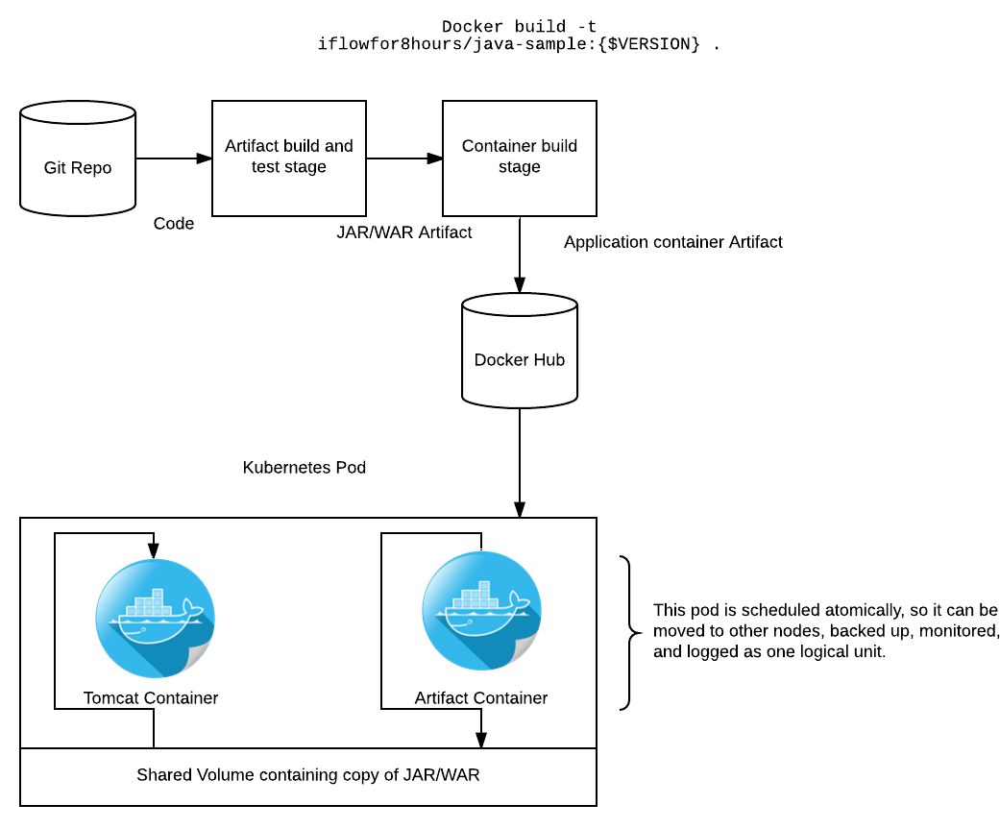

## A short dip into Kubernetes and Java Spring Cloud

The intention of this article is to learn a little about running real applications on kubernetes, learn to do some kubernetes troubleshooting, and show you around the information that kubernetes gives you to deploy high availability, containerized applications on a cluster.

This article is a "spiritual" continuation of a [Jenkins 2.0 tutorial I authored](https://github.com/iflowfor8hours/jenkins2-pipeline-demo) and is utilizing the [CoreOS Kubernetes tutorial](https://coreos.com/kubernetes/docs/latest/kubernetes-on-vagrant-single.html). Meaning that I'm using the same application from the previous article and that some time in the future, I might put the two together and create a post about using the deployment pipeline to deploy to a Kubernetes cluster for specific environments and promote to pivotal cloud using that Jenkins pipeline. CorOS is the easiest way to get a kubernetes cluster running and configured on your local machine or in the cloud so I'm using that as the starting point. Kubernetes is complex enough as it is.

The tutorial part of this assumes that you have a single node cluster setup and running on your local machine. If you would like to follow along, follow the instructions from the [CoreOS Documentation](https://coreos.com/kubernetes/docs/latest/kubernetes-on-vagrant-single.html) to spin one up using Vagrant. Don't forget to source the environment configuration in that article otherwise not nothing will work. Otherwise, this article has a decent intro to Kuberentes concepts, and hopefully you can learn something from that.

I have a stateless [Java Spring Cloud application](https://github.com/iflowfor8hours/sample-spring-cloud-svc-ci) that I want to move to a Kubernetes cluster with the goal of making it both fault tolerant and cloud-agnostic. I currently can build and test it locally, and it runs just fine inside a Docker container as well, as evidenced by deploying it to Pivotal Cloud.

Conceptually, it is important to note how this application is built and deployed. I'm using a pattern referred to as "The Sidecar Pattern". In this pattern, the application artifact is packaged in a minimal container which only holds our built artifact. At runtime, the artifact is copied into a volume shared by both the Tomcat and artifact container. The Tomcat container is configured to look for the application in the shared volume and thusly runs it. This seemed like a strange way of doing things to me initially, but it gives us a few very real advantages in the Kubernetes world.

1. Node flexibility - If the artifact were on a shared node volume, and that node went down, your application could not be rescheduled to another node without some other layer of volume management like NFS or something. This patter decouples us from the node filesystem.
2. Deployment flexiblity - Our tomcat container is completely generic. As long as our build system outputs a container and the tomcat container is pointed at it, our application runs. Conversely if we packaged the application into the tomcat container, whenever we update application code, we need to repackage the whole thing, golden image style.
3. Server configuration flexibility - If we want to patch tomcat or deploy another app server but not redploy the application, this is dead easy. Just push a new tomcat image and let Kubernetes deal with doing a rolling upgrade.
4. Version orthodoxy - We can version and artifact our application code cleanly and consistently from source to artifact to container. This exposes that information in a clean way to operators and developers. Devops people will emit sigh of relief in the continuous delivery temple.



Much of this information can be learned from the [Kubernetes Config Best Practices guide](http://kubernetes.io/docs/user-guide/config-best-practices/) and the [Kubernetes Documentation](http://kubernetes.io/docs).

The first step is to define a Kubernetes service for the application. A service is a named load balancer that proxies traffic to one or more containers. This means that when one creates a service, no containers that are actually launched. All we're doing is exposing an endpoint to the outside world. You can define a port or use the one that is assigned by Kubernetes. In the service discovery world, if you're worried about manually mapping port numbers, you have bigger problems.

The file below is our service definition file `sample-app-service.yaml` for our web application. The tricky line is the `type: NodePort` line. This exposes our app to the node, allowing us to access it from outside the cluster. Read up on the different types [in the documentation](http://kubernetes.io/docs/user-guide/services/#publishing-services---service-types)

```
apiVersion: v1
kind: Service
metadata:
  name: sample-application
  labels:
    app: sample-application
    tier: frontend
spec:
  type: NodePort
  ports:
  - port: 8080
  selector:
    app: sample-application
    tier: frontend
```

After creating this file, run the following to deploy it to the Kubernetes api. The output you receive will tell you where your app is exposed.

```
$ kubectl create -f sample-app-service.yaml 
You have exposed your service on an external port on all nodes in your
cluster.  If you want to expose this service to the external internet, you may
need to set up firewall rules for the service port(s) (tcp:30060) to serve traffic.

See http://releases.k8s.io/release-1.3/docs/user-guide/services-firewalls.md for more details.
service "sample-application" created
```

Now you should be able to see your service by executing `kubectl get services` to show that it is exists.

```
$ kubectl get services                 
NAME                 CLUSTER-IP   EXTERNAL-IP   PORT(S)    AGE
kubernetes           10.3.0.1     <none>        443/TCP    4h
sample-application   10.3.0.58    <nodes>       8080/TCP   5m
```

Next, we need to create a deployment for our application. A deployment is responsible for managing multiple instances of a replicated pod. The deployment will automatically launch new pods if the number of replicas falls below the specified number. We will use this here to deploy multiple instances of our application cluster for redundancy and availability. In production, we would deploy these across multiple Kubernetes nodes.

There is quite a lot to consumer in this file. In the deployment spec section, we're specifiying that we want three pods created, and giving some metadata to match our existing service. In the template spec section, we're defining what containers we want o run, our mounts, and what ports to expose *to the service*. This is where the conceptual model of Kubernetes started to get confusing to me.

```
apiVersion: extensions/v1beta1
kind: Deployment
metadata:
  name: frontend
  labels:
    app: sample-application
spec:
  replicas: 3
  selector:
    matchLabels:
      app: sample-application
  template:
    metadata:
      labels:
        app: sample-application
        tier: frontend
    spec:
      containers:
      - name: jar
        image: iflowfor8hours/java-sample
        volumeMounts:
        - mountPath: /app
          name: app-volume
      - name: java-runtime
        image: openjdk:latest
        command: ["java","-jar","/opt/app/app.jar"]
        volumeMounts:
        - mountPath: /opt/app
          name: app-volume
        ports:
        - containerPort: 8080
      volumes:
      - name: app-volume
        emptyDir: {}
```

In Kubernetes, containers inside a pod can always communicate, and even share memory. They can also expose ports to other pods or to services, as shown above. In our case, the container exposes 8080 to the scheduler. The scheduler knows that we have defined a replicated service on port 8080 and schedules three pods, all exposing port 8080. The service load balances between the pods and exposes a port to the node, using the `NodePort` option from the previous file. This allows us to access our application externally.

Launch our containers and schedule them using `kubectl create -f sample-app-deployment.yaml`

Check if anything went wrong with `kubectl get deployments` and `kubectl describe deployments`

```
$  kubectl get deployments
NAME       DESIRED   CURRENT   UP-TO-DATE   AVAILABLE   AGE
frontend   3         3         3            3           42m

$ kubectl describe deployments
Name:     frontend
Namespace:    default
CreationTimestamp:  Fri, 07 Oct 2016 13:12:48 -0400
Labels:     app=sample-application
Selector:   app=sample-application
Replicas:   3 updated | 3 total | 3 available | 0 unavailable
StrategyType:   RollingUpdate
MinReadySeconds:  0
RollingUpdateStrategy:  1 max unavailable, 1 max surge
OldReplicaSets:   <none>
NewReplicaSet:    frontend-1616865337 (3/3 replicas created)
Events:
  FirstSeen LastSeen  Count From        SubobjectPathType   Reason      Message
    --------- --------  ----- ----        --------------------- ------      -------
      43m   43m   1 {deployment-controller }      Normal    ScalingReplicaSet Scaled up replica set frontend-1616865337 to 3
```

Your application should now be running in a replicated state, and accessible from your machine at the IP address of your CoreOS host and the port that Kubernetes output when you created the service. Test this out with `curl http://172.17.4.99:30060`.

I hope this was a helpful introduction to Kubernetes. Drop any feedback to @iflowfor8hours.

Note that the application is NOISY, you'll see a lot of exceptions in the application log, because spring is configured in such a way that it is attempting and failing to do service discovery. That is a problem for another day.

To get this working, I did a lot of troubleshooting, and learned a lot about querying my cluster and the various services inside of it. Here is a quick reference of the relevant commands used to figure out what is going on in Kubernetes

```
# To get the Kubernetes node cluser addresses and confirm you can speak get to the API
kubectl get nodes

# To get information about running services
kubectl get services

# To get more information about services
kubectl describe services sample-application

# To list running pods (groups of containers)
kubectl get pods

# To get more information from an individual pod
kubectl describe pods frontend-1616865337-dcybo

# To get information from individual containers running in those pods
kubectl logs frontend-1616865337-dcybo java-runtime
```
