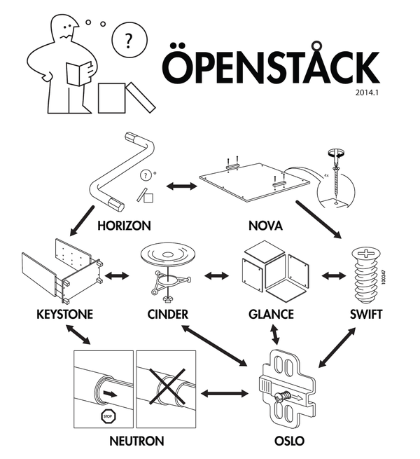

On the heels of [Google's exciting annoucement](http://www.infoworld.com/article/2948901/openstack/4-reasons-google-joined-openstack.html) about the integration between OpenStack and GCE, I was excited to give it a go. I was thrilled to hear about Google joining the OpenStack foundation, because having a serious development focused company at the table might bring some maturity and focus to the OpenStack developer experience. As a former contributor to OpenStack and former operator of one of the largest public OpenStack based public clouds at Rackspace, I was interested to see how well it works.

Openstack is quite a difficult beast to get started with, as it is componentized in a way that does not lend itself to simplicity for the first time user. There is a quite a large vocabulary of elements that need to understood and configured before you can begin to getting some value out of it. This is not meant to be a primer on the intracacies of how OpenStack works, but I would like this article to be accessible to those unfamiliar with the ecosystem.

This image sums up the confusion that I felt when initially confronted with the operation of an OpenStack cloud.

The components of OpenStack are enumerated below. I lifted these straight from the OpenStack mitaka install guide, so if you need more information, go have a look [there](http://docs.openstack.org/mitaka/install-guide-ubuntu/overview.html).

Nova:  Manages the lifecycle of compute instances in an OpenStack environment. Responsibilities include spawning, scheduling and decommissioning of virtual machines on demand.

Horizon: Provides a web-based self-service portal to interact with underlying OpenStack services, such as launching an instance, assigning IP addresses and configuring access controls.

Neutron: Enables Network-Connectivity-as-a-Service for other OpenStack services, such as OpenStack Compute. Provides an API for users to define networks and the attachments into them. Has a pluggable architecture that supports many popular networking vendors and technologies.

Swift: Stores and retrieves arbitrary unstructured data objects via a RESTful, HTTP based API. It is highly fault tolerant with its data replication and scale-out architecture. Its implementation is not like a file server with mountable directories. In this case, it writes objects and files to multiple drives, ensuring the data is replicated across a server cluster.

Cinder: Provides persistent block storage to running instances. Its pluggable driver architecture facilitates the creation and management of block storage devices.

Keystone: Provides an authentication and authorization service for other OpenStack services. Provides a catalog of endpoints for all OpenStack services.

Glance: Stores and retrieves virtual machine disk images. OpenStack Compute makes use of this during instance provisioning.

Heat: Orchestrates multiple composite cloud applications by using either the native HOT template format or the AWS CloudFormation template format, through both an OpenStack-native REST API and a CloudFormation-compatible Query API.

If you haven't fallen asleep yet, then you've probably noticed that OpenStack is a bit complex for the uninitiated. Luckily for us [devstack](https://github.com/openstack-dev/devstack), OpenStack's test bed, is pretty straightforward to get up and running. 

I spun up a virtual machine using Vagrant and virtualbox and got started. The goal of this exercise is to get openstack running, then try to add some capacity from GCE. If I'm feeling ambitious, I may try and autoscale a hello world application running in both private and public cloud.

My first attempt at running `./stack.sh` wound up with an OOM error.

  /vagrant/functions-common: fork: Cannot allocate memory

I added another two gigs of memory, bringing up the total to 4096, to the virtual machine and tried again.

    This is your host IP address: 10.0.2.15
    Horizon is now available at http://10.0.2.15/dashboard
    Keystone is serving at http://10.0.2.15:5000/
    The default users are: admin and demo
    The password: password
    2016-04-19 00:21:45.904 | stack.sh completed in 724 seconds

